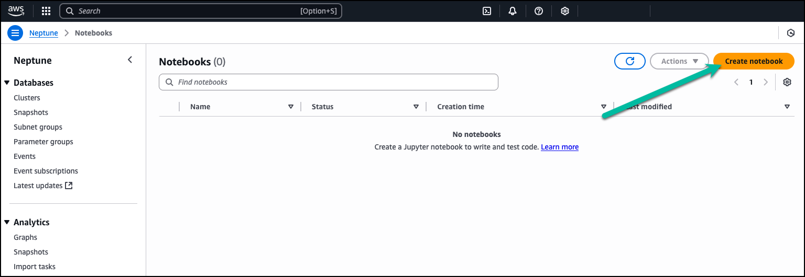
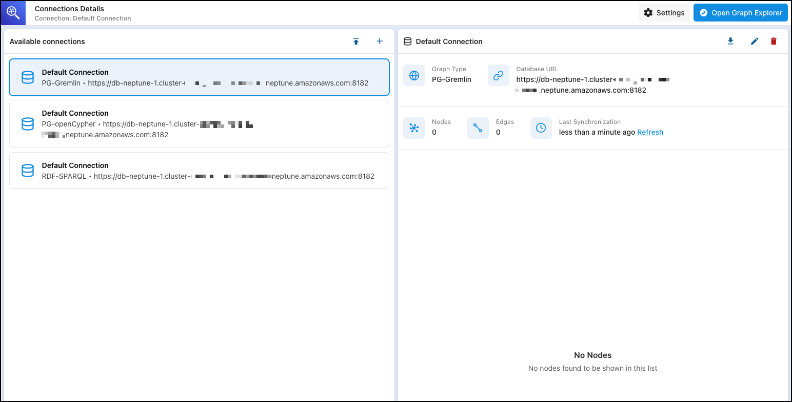

# Deployment Models

The AWS Graph Explorer project provides a container image to quickly get started with visualizating data from within your graph database.  The container image can be used in either a self-managed deployment or using AWS managed services.  The following two options are documented below.  If you want to build the entire project from source, please refer to the [developer documentation](../05-Developer%20Guide/buildfromsource.md).

## AWS Managed Graph Explorer

If using Graph Explorer with Amazon Neptune Database or Analytics, we suggest deploying Graph Explorer through the use of a Neptune Notebook instance.  

:::info
The following process assumes that you've already created a Neptune Database cluster or a Neptune Analytics graph.  If you created a Neptune Database cluster and plan to use IAM Authentication, ensure [IAM Authentication is enabled](https://docs.aws.amazon.com/neptune/latest/userguide/iam-auth-enable.html) on the cluster before creating the Notebook instance.  Otherwise, additional configuration may be needed to use IAM Authentication from both the Notebook instance and Graph Explorer.
:::

### Create a New Notebook Instance 

1. To deploy a new Notebook instance go to the [AWS Console](https://us-east-1.console.aws.amazon.com/neptune/home?region=us-east-1#) for Neptune and click Notebooks from the left-hand menu.  

    

2. Click on the `Create Notebook` button in the top right corner.

    

3. Define the Notebook's configuration based on your use of either Neptune Database or Neptune Analytics.

    - **Neptune Service & Cluster/Graph:**  If using Neptune Database, you'll need to define the Neptune Database cluster being used.  If using Neptune Analytics, you'll need to define the Neptune Analytics Graph being used.  
    - **Notebook Instance Type:**  Choose the instance type and size to use.  If you're only using the notebooks for querying your cluster/graph and using Graph Explorer, the default `ml.t3.medium` instance is sufficient.  If looking to perform other data transformations or run other Python related code, you may want to use a larger instance size.
    - **Notebook Name**:  Provide a unique name (unique to your account/region) for this notebook instance.
    - **IAM Role/Name**:  You can choose to have the console generate an IAM role for you, or you'll need to provide a role with the proper permissions.  Details on required permisssions can be found [here](https://docs.aws.amazon.com/neptune/latest/userguide/graph-notebooks.html#graph-notebooks-workbench).

    

4.  Provide the required network configuration for your Notebook Instance.

    :::info[Note]
    See the Architecture section of this documentation for more details on the network configuration of Graph Explorer and Neptune Notebooks.
    :::

    - **Neptune Database Cluster**:  If using a Neptune Database Cluster, the Notebook instance will need access to the VPC used by the Neptune Database Cluster.  
    - **Neptune Analytics Graph**:  If using a Neptune Analytics Graph, your configuration will depend on the network configuration for your Graph.  If your Graph is using public endpoints, you do not need to configure VPC settings.  If your graph is configured using a Private Graph Endpoint of VPC Endpoint, you'll need to provide the following VPC information.
    - **Internet Access**:  Determine how the Notebook Instance will reach the Internet, either through the SageMaker owned VPC or through your own VPC.

    :::warning[Important]
    The Graph Explorer container image used when deployed in a Neptune Notebook instance is fetched from the [AWS ECR Public Gallery](https://gallery.ecr.aws/neptune/graph-explorer).  If Internet Access is changed to `Access through a VPC`, you'll need to provide additional configuration in your VPC to allow the notebook instance to fetch the container image from the Public Gallery.  This may include, but is not limited to, using a Internet Gateway or a NAT Gateway to allow the Notebook Instance to reach the ECR Public Gallery.  VPC Endpoints (PrviateLink) for ECR [do not currently support access for public images](https://docs.aws.amazon.com/AmazonECR/latest/userguide/vpc-endpoints.html#ecr-vpc-endpoint-considerations). 
    :::

    

5. Add any additional tags, if desired (not required), and click `Create notebook` to provision the Notebook Instance.

    

### Accessing Graph Explorer

1. To access Graph Explorer, go to the Neptune Notebooks page and select the Notebook Instance that you just deployed.  Click on the `Actions` menu in the top-right corner and choose `Open Graph Explorer`.

    

2. Your browser will open a new tab and will proxy through the SageMaker Notebook console before opening Graph Explorer.  Graph Explorer will launch into the Connections console as shown below.

    

3.  Check out the [Managing Connection](../03-Using%20Graph%20Explorer/connections.md) and [How to Visualize Your Graph](../03-Using%20Graph%20Explorer/visualizing.md) sections on how to proceed from here.

## Self Managed Graph Explorer

